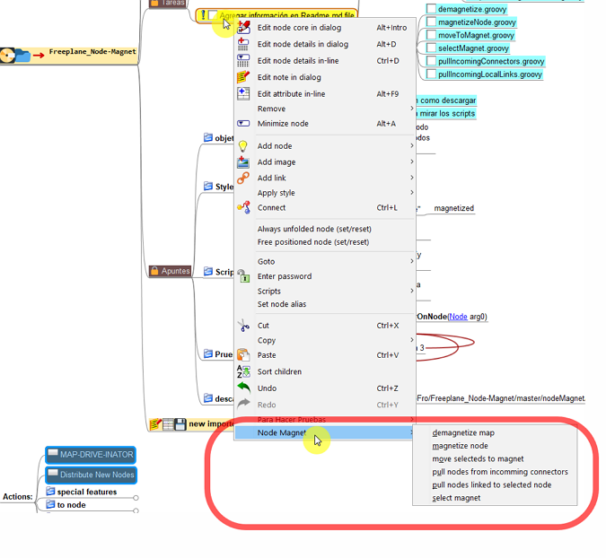
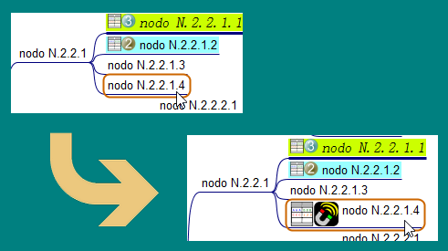
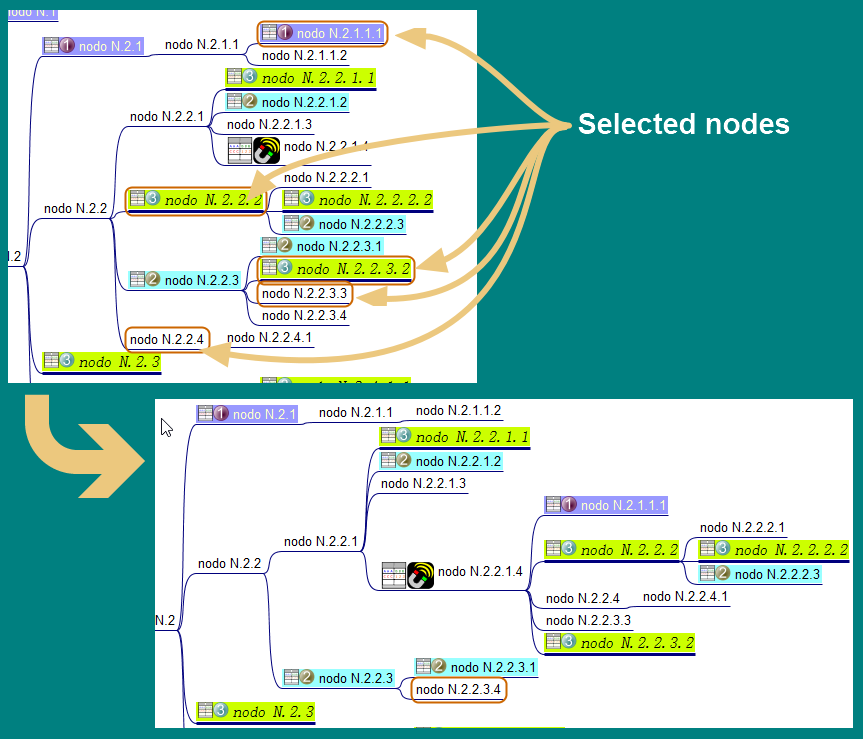
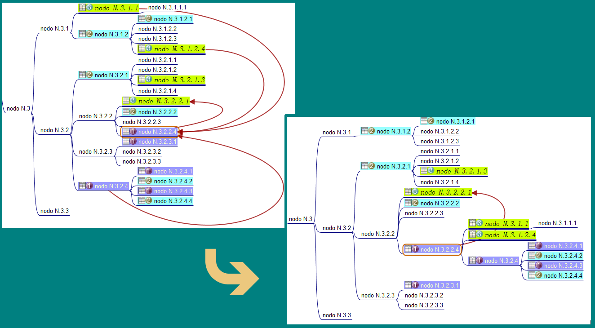
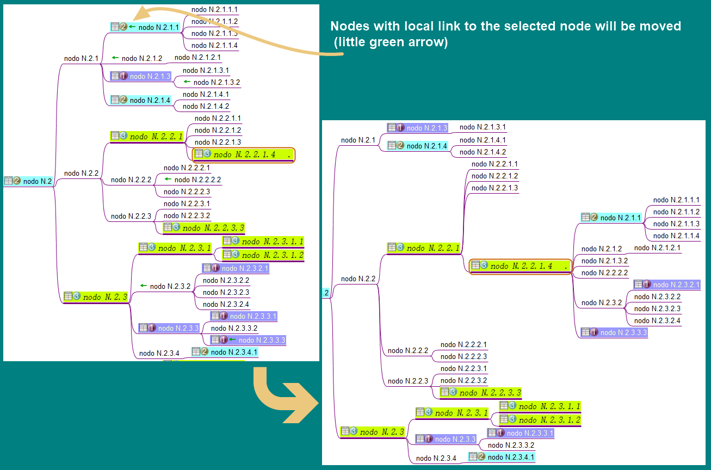
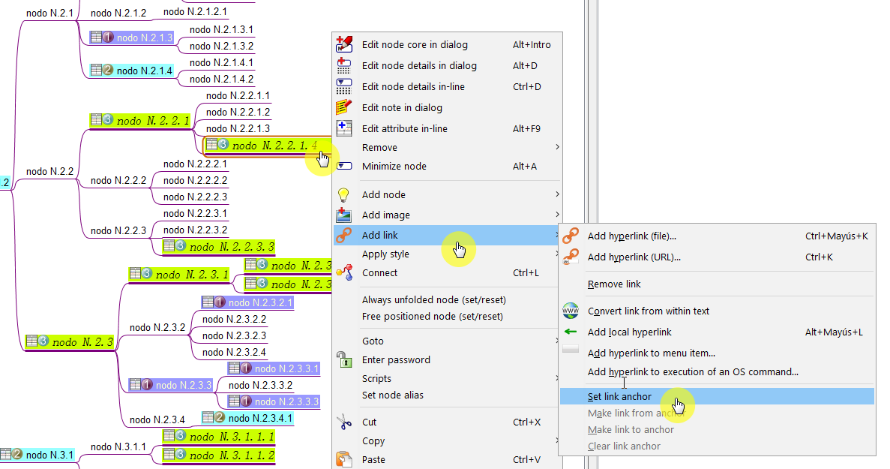
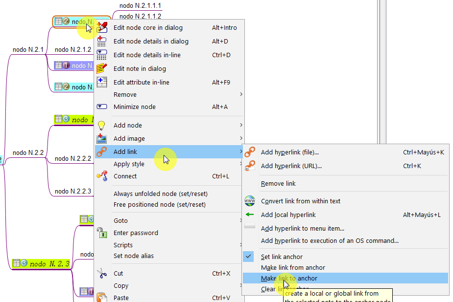

# Freeplane_Node-Magnet

in few words:

* groovy scripts to mark a node as magnet and then move selected nodes to it

---

## Description

Node-Magnet is a little AddOn for Freeplane MindMapping application. It adds commands to the node pop menu to easily move several nodes to another one. This can be useful for big maps where the nodes to be moved are far away from each other or from the destiny node.

more on Freeplane:

* [Freeplane Home Page](https://www.freeplane.org/wiki/index.php/Home)
* [Freeplane project page on Sourceforge](https://sourceforge.net/projects/freeplane/)

---

## Download and Install

To install this AddOn you have to download the file "nodeMagnet-vX.X.X.addon.mm" from the [nodeMagnet folder](nodeMagnet/) to your computer, open it with Freeplane and follow the displayed instructions.

to download the file you can download or clone the whole project, or execute the following command from the command prompt in your computer (this works in Windows 10, but I think cURL is in other OS too):

`curl -O https://raw.githubusercontent.com/EdoFro/Freeplane_Node-Magnet/master/nodeMagnet/nodeMagnet-v0.0.1.addon.mm`

and the file will download to the active directory.

---

## Node pop up menu

After installing the AddOn you have to restart Freeplane to get the new commands in the node menu.

When clicking with the right button of the mouse on a node it displays a pop up menu. At the bottom of it, the new commands will appear (look at the image).

---

## Magnet commands

---

### magnetizeNode

Magnetize a node is the way to mark it as the destination node, where later all selected nodes are going to be moved to.

---

### moveToMagnet

After selecting a node as magnet (destination), you can select the nodes you want to be moved to this destination node.

You can do this in little batchs if you like, the magnetized node stays as destination till you demagnetize the map.

---

### selectMagnet

You can use this command if you want to jump directly to the magnetized node. This can be useful when working in a big mindmap you have been sending nodes to it and now you want to return to the magnet and continue your work there.

---

### demagnetize Map

Use this command to unmark any magnetized node in the map.

---

## Other commands

This commands are not directly related with the previous ones, but they are very similar in their purpose.

### pullIncomingConnectors

This command take all nodes that are connected to the selected node through incomming connectors and move them to it. Look at the image for better understanding:

---

### pullIncomingLocalLinks
This command is like the previous one, but it moves all nodes that are pointing with local links to the selected node to it. Look at the image for better understanding:

You can use this Freeplane options to set this links:

* set anchor node:

* set links to anchor node:

---

## Groovy Scripts

The scripts in this AddOn are very simple ones and I have added comments so they are easy to understand and learn from.

I'm learning also, so if you see something that can be improved, please let me know.
